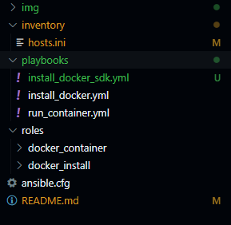
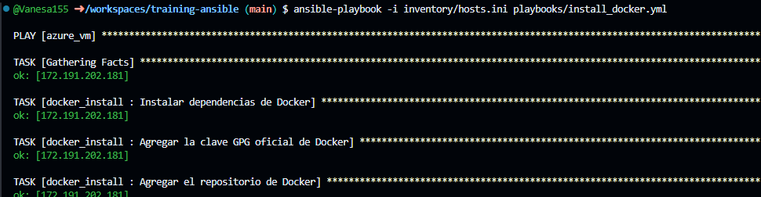
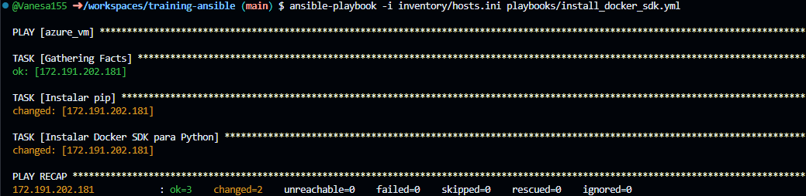
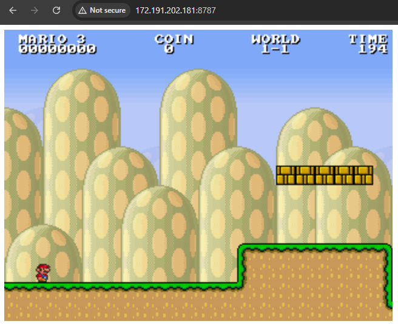
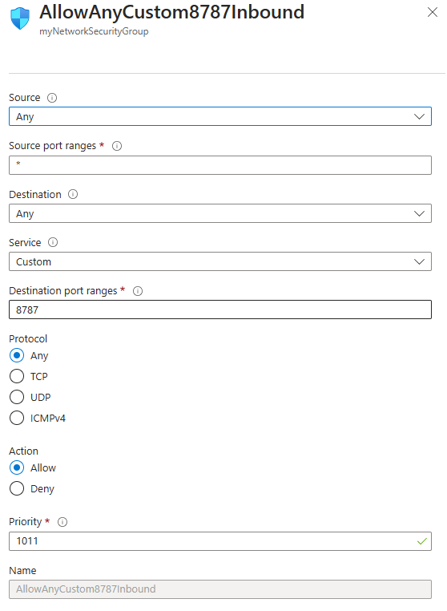
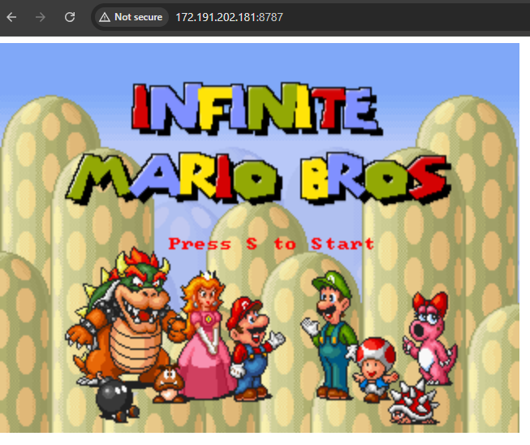

# 🏗️ Implementación de "Mario Bros" en Azure con Docker

## 📌 Descripción
Este proyecto despliega el juego **"Mario Bros"** dentro de un contenedor **Docker** en una máquina virtual de **Azure**. Para ello, se utiliza **Ansible** para automatizar la instalación y configuración del entorno.

🚀 **Principales tareas ejecutadas:**
1. Instalación de Docker en la VM de Azure.
2. Instalación del Docker SDK para Python.
3. Creación y ejecución del contenedor con el juego.
4. Configuración de reglas de seguridad para permitir el acceso.

---

## ⚙️ **Prerrequisitos**
Antes de ejecutar Ansible, asegúrate de tener instalado:

- [Azure CLI](https://learn.microsoft.com/en-us/cli/azure/install-azure-cli)
- [Ansible](https://docs.ansible.com/ansible/latest/installation_guide/intro_installation.html)
- [Docker](https://docs.docker.com/engine/install/)

Verifica la instalación con:
```bash
az --version
ansible --version
docker --version
```

---

## 📂 **Estructura del Proyecto**
```plaintext
.
├── inventory/hosts.ini      # Inventario de Ansible
├── playbooks/
│   ├── install_docker.yml   # Instala Docker en la VM
│   ├── install_docker_sdk.yml # Instala el SDK de Docker
│   ├── run_container.yml    # Ejecuta el contenedor con el juego
├── img/                    # Evidencias en capturas de pantalla
└── README.md                # Documentación del proyecto
```



---

## 🚀 **Pasos de Implementación**

### **1️⃣ Instalación de Docker en la VM**
Se ejecuta el siguiente playbook:
```bash
ansible-playbook -i inventory/hosts.ini playbooks/install_docker.yml
```
✅ **Resultados:**
- Se instalaron las dependencias de Docker.
- Se agregó la clave GPG oficial de Docker.
- Se configuró el repositorio de Docker.
- Se instaló Docker CE.



---

### **2️⃣ Instalación del Docker SDK para Python**
Se ejecuta el playbook:
```bash
ansible-playbook -i inventory/hosts.ini playbooks/install_docker_sdk.yml
```
✅ **Resultados:**
- Se instaló pip si no estaba presente.
- Se instaló el Docker SDK para Python.



---

### **3️⃣ Ejecución del Contenedor con el Juego**
Se ejecuta el siguiente comando:
```bash
ansible-playbook -i inventory/hosts.ini playbooks/run_container.yml
```
✅ **Resultados:**
- Se creó y ejecutó un contenedor Docker con el juego **"Mario Bros"**.



---

## 🔐 **Configuración de Seguridad en Azure**

### **4️⃣ Configuración del NSG (Network Security Group)**
Se verificó el grupo de seguridad asociado a la VM y se agregó una nueva regla para permitir el acceso al juego.

🔧 **Nueva regla de seguridad:**
| Nombre              | Prioridad | Protocolo | Puerto de destino | Acción   |
|---------------------|----------|-----------|-------------------|----------|
| Allow-Mario-Game   | 1000     | TCP       | 8787              | Permitir |



---

## 🎮 **Acceso al Juego**
Una vez finalizada la configuración, el juego se puede acceder mediante un navegador en la dirección:

```plaintext
http://<IP_PUBLICA>:8787
```
Ejemplo:
```plaintext
http://172.191.202.181:8787/
```



---

## 📝 **Notas Finales**
- Se recomienda verificar la IP de la VM en Azure antes de acceder al juego.
- Se pueden modificar los playbooks para cambiar la configuración del contenedor.

🚀 **Implementación exitosa del juego "Mario Bros" en Azure con Docker y Ansible!**

---

## <b> Autora </b>

+ [Gloria Vanesa](https://github.com/Vanesa155 "Vanesa V.")

[](https://forthebadge.com)

